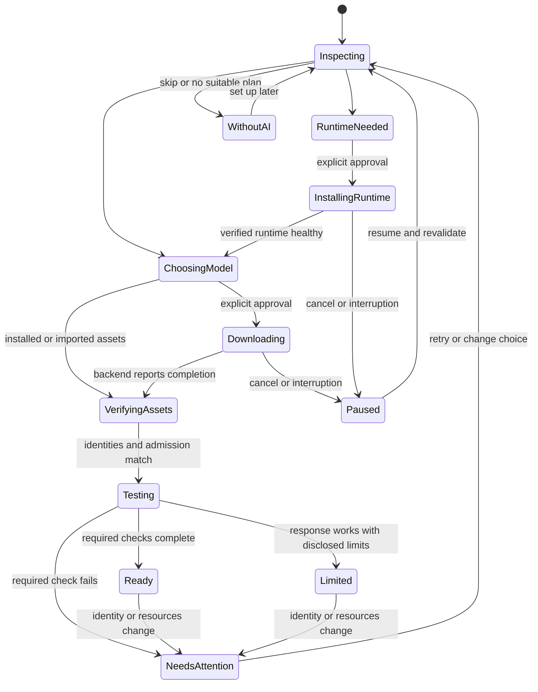

# CETA: dependable offline assistant implementation plan

Date: 2026-09-25. Status: **proposed implementation plan, grounded in a read-only source audit**.

The requested outcome is a native local assistant that adapts to the computer on
which it is installed, explains what it can actually do, and remains useful after
the first successful demo. The immediate target is the existing Windows x64 CETA
application. This document does not claim that the proposed changes are implemented,
that historical checks were rerun, or that a new release is ready.

## 1. Decisions and the product contract

Build toward this acceptance scenario:

> A new user installs CETA on a fresh supported Windows computer, sees a model
> recommendation based on that computer, explicitly installs the runtime/model,
> completes a real local response, disconnects from the internet, uses chat and
> selected project files, stops a response, closes the application, returns the
> next day, and continues with the same conversation and intact project history.

The application must also work honestly on a computer that cannot run a suitable
model: files, saved conversations, project inspection, and explicit tools remain
available, while inference explains the missing requirement and a useful next step.

Decisions for the first implementation:

1. Retain CETA's native PySide6 application, existing visual identity, SQLite
   journal, local provider interface, authority checks, and release tooling.
2. Use a CETA-managed, versioned Ollama runtime as the normal setup path, subject
   to the runtime packaging/compatibility gate below. Keep existing external
   Ollama installations and imported GGUF/llama.cpp as explicit supported paths.
3. Never silently install software, download weights, send a prompt, switch
   models, unload somebody else's work, or change a shared service's configuration.
   One explicit setup action may authorize its fully described download/start/test
   sequence; recovery does not require repeatedly asking for the same authorization.
4. Read the current device at startup/setup and again at admission. Ship generic
   policy and model metadata, never a development machine's readings or readiness.
5. Separate five questions: can the weights be stored; might they fit; can this
   backend execute them; did this exact configuration complete a request; what
   task-specific checks and performance measurements have passed?
6. More usable RAM/VRAM may permit a larger model, more context, or another
   supported feature. It does not confer a new modality, permission, or measured
   quality by itself. Integrated memory is counted once; multiple GPUs are not
   pooled unless that exact execution arrangement is qualified.
7. Make text chat and existing reviewed project work dependable before adding
   vision, voice, retrieval indexes, or model-directed multi-step execution.
8. Keep reference training separate from the desktop dependency closure. Resolve
   the recorded training advisory in its own work package without importing the
   training stack into the desktop installer.

No source from another project is required. The already integrated, authorized
Model 001 components remain part of this checkout; this plan authorizes no new
cross-project transfer. No signing credentials or publication are needed to write
or implement the local candidate. Any later release action must use the user's
actual existing authorization and available publisher identity.
Website repository changes are outside this planning scope. If public delivery
requires editing a separate website project, identify that source/destination
and obtain or verify its specific authorization before crossing that boundary;
continue CETA artifact preparation and read-only public checks independently.

## 2. Baseline and what the evidence means

Inspected repository: `T:\00-Active\CETA-desktop-delivery-20260906`.
Branch: `codex/ceta-desktop-release`.
Clean baseline commit: `aadbeb1aff74118e6042cd5194268ebba6d18e28`, dated 2026-09-21.
Desktop version: `src/ceta_desktop/__init__.py` reports 0.4.0. Reference library
`VERSION` and `pyproject.toml` remain 0.3.0 intentionally; do not normalize them
as though they were an accidental mismatch.

| Area | Current source / recorded evidence | What remains to establish |
| --- | --- | --- |
| Hardware inventory | Current system RAM/CPU, NVIDIA free VRAM, native DXGI inventory/process budget; synthetic portability tests | Backend-supported device selection, effective memory domains, stale-state admission, usable performance |
| Local generation | Loopback transport, Ollama cloud-alias refusal, memory checks, bounded probes and cancellation | End-to-end request budget, model/runtime identity binding, shared-runtime admission and truthful stop states |
| Native work | Persistent chat, workspace editing/search, reviewed effects, explicit commands, task journal | Next-day task continuation, usable recovery, attachment provenance, archive retrieval, responsive long reads |
| Local release candidate | Merger record reports 564 full tests and 475 desktop tests, one skip in each; unsigned 0.4.0 installer | Qualification of the next exact candidate, current dependencies and actual supported hardware |
| Offline lifecycle | Recorded network-disabled Sandbox upgrade/migration/restart/uninstall with synthetic fixtures | Installed real-model generation in an OS-isolated environment; this is a separate test lane |
| Distribution | Existing installer, notices/source companion, update verification, optional signing tools | Current candidate signatures, fresh first-attempt TLS behavior, public byte identity and installed-client update |

Sources: [merger implementation record](MERGER_IMPLEMENTATION_20260919.md),
[machine-readable merger evidence](../../evidence/CETA_MODEL001_MERGER_20260919.json),
[continuity map](CONTINUITY_MAP.md), and the current source call sites below.
These are historical execution records plus a current source inspection, not a
new passing test run. The old installer was not rehashed or executed in this
planning turn. `docs/DESKTOP_DELIVERY.md` still labels 0.3.3 as current; its current
summary must be reconciled with the dated 0.4.0 candidate record while retaining
the historical sections.

## 3. Concrete findings to repair first

The priorities below mean impact on the proposed dependable release, not proof
that every possible failure has already occurred. Source-level gaps must become
reproducing tests before behavior is changed.

| ID | Priority | Evidence at this commit | Required result |
| --- | --- | --- | --- |
| F01 | P0 | `runtime/tasks.py:start_task` grants 24 hours; `_access` enforces expiry. `app.py:_resume_project_task` and `select_project_task` reuse saved tasks without a renewal flow. | A next-day user can explicitly resume the same task with a fresh grant; history stays intact and revoked grants remain distinct. |
| F02 | P0 | `app.py:send_message` accepts up to 512,000 serialized characters; `project_tools.py:MAX_CONTEXT_CHARS` allows 64,000 more; `tasks.py:generate` adds system/context text. Requests use 4096 context tokens and may request 4096 output tokens. | Account for the complete submitted request, template overhead and output reserve before admission. No silent loss of mandatory instructions. |
| F03 | P0 | `app.py:attach_document` pastes editor text, but `send_message` does not pass selected paths to `TaskRuntime.generate`. Instruction discovery in `compile_project_context` depends on those paths. | Nested source instructions, source identity and draft identity accompany attachments; a preview describes the actual submitted content. |
| F04 | P0 | `hardware.py:assess_model` approves GPU capacity without binding the backend/device; DXGI reports the CETA process budget. | Approval names a supported execution configuration. An unsupported GPU leads to a newly assessed CPU plan or an explicit refusal. |
| F05 | P0 | `app.py:start_model` rejects only `insufficient`; unknown memory proceeds. GGUF chat becomes generic OpenAI transport without the same context/resource checks; the probe is Ollama-only. | Owned GGUF start/chat/probe enforce the same admission contract and verified startup arguments. |
| F06 | P1 | `LocalProvider._active` belongs to one provider; callers create multiple providers. `_PROBE_LOCK` only coordinates probes and `/api/ps` is a snapshot. | Coordinate cooperating CETA requests to one runtime across tasks; do not claim exclusivity over external clients. |
| F07 | P1 | `LocalProvider.stream` clears `client.cancelled`; caller and client can share the event. Connection/write/inventory stages have different bounds. | Request-scoped cancellation cannot be lost; every stage has a deadline; UI distinguishes stopped output from server termination. |
| F08 | P1 | `_preflight_ollama` rejects another resident model; UI cannot inspect and explicitly unload it without using another tool or stopping an owned service. | Show residency and offer a scoped, explicit model switch without killing an external service. |
| F09 | P1 | Startup, runtime installation, model download, refresh, selection and probe are disconnected manual steps in `app.py`. | One resumable setup path presents the next useful action and lets users skip inference. |
| F10 | P1 | `recommended_model` chooses the largest fitting candidate. Readiness is one nonempty completion; digest/configuration identity and task quality are not represented. | Offer estimated candidates before installation and measured profiles afterwards; never equate a short response with general competence. |
| F11 | P1 | Recovered task IDs are ignored at startup; raw timeline JSON is the main inspection surface. Constructor failures can escape before usable recovery UI. | Show interrupted/uncertain work and non-destructive recovery actions, including inaccessible keys and unsupported/corrupt databases. |
| F12 | P2 | `Store.conversations` hides archived rows; no ordinary archived listing/restore path exists. Search filters titles/dates. | Read, export, restore and search retained conversations without changing their project/task identity. |
| F13 | P2 | `_task_read_action` and workspace opening perform potentially slow Git/filesystem work synchronously. | Cancellable workers keep the UI responsive and reject stale results from another task. |
| F14 | P1 | Generic SSE can end with `[DONE]` without visible text; generic runtime locality/context remains unverified. | Reject empty/malformed completion consistently and label advanced external endpoints accurately. |
| F15 | Release | `verify_desktop_inference.py` uses source UI; Sandbox lifecycle uses synthetic work, networking/vGPU off and 3 GiB RAM. | Qualify actual frozen application + real model offline in a separate adequately provisioned lane. |
| F16 | P0 | `runtime/runtime_keys.py:runtime_keys` creates new authority/identity/gateway/observer keys when its file is absent, without checking for existing governed history. | Existing history plus missing/corrupt/inaccessible identity enters preserved read-only recovery; it must not silently create replacement authority. Fresh installations still initialize their own identity. |

## 4. User experience to implement

### First launch

Show a compact **Set up local AI** card in the existing application. Keep the
current sidebar and Models page; do not send users through a replacement shell.
There are three entry actions: **Set up local AI**, **Use an existing local model**,
and **Continue without AI**. The normal path does not require typing a model tag,
endpoint URL or executable path.

1. Inspect OS/architecture, usable physical memory, graphics devices, backend
   compatibility and destination disk space asynchronously. Distinguish capacity,
   current availability, unknown values and unsupported features.
2. Discover an existing runtime without modifying it. Offer either that external
   runtime, with its ownership/limitations visible, or an isolated CETA-managed
   runtime. Default new installations to the managed path once qualified.
3. Present at most three candidates: **lighter/faster candidate**, **balanced
   candidate**, and **larger candidate**. Before local measurement these are
   estimates. Show download size, disk location, model source/license, intended
   text tasks, context limit and why a candidate is unsuitable now.
4. One **Install and test** action approves the listed runtime and model bytes,
   their location, local service startup, and a bounded synthetic test. It does
   not approve commands proposed by a model or any project-data upload.
5. Display download byte progress only when reported; otherwise name the actual
   stage. Show resumable interruption, disk-full, permission, connectivity and
   integrity failures with a direct next action.
6. Verify the obtained runtime/model identity, start the owned runtime, wait for
   health/model availability, then run the bounded test through `TaskRuntime` and
   `LocalProvider`. Do not add a second ungoverned inference path.
7. Open Chat with the chosen model and a readable result such as **Local text chat
   tested**, **Limited: slow response on this configuration**, or **Setup needs
   attention**. Details contain the measurements and their scope.

An offline fresh install offers **Import an offline pack** or **Continue without
AI**. Missing assets never trigger an invisible network attempt. An offline pack
contains a manifest, exact runtime/model identities and required notices; an
executable runtime is admitted only through the trusted package path. Importing
an arbitrary GGUF remains an advanced explicit model import, not a runtime installer.

### Returning users

- Open their conversation immediately; scan hardware and check the selected
  runtime asynchronously. A previous result is historical until current identity
  and execution settings match and current resource admission succeeds.
- Preserve model preferences across restart, while recalculating recommendations
  on the actual computer. Copying the data directory must not copy live readiness.
- Expose expired task authority with **Resume task**. That explicit action grants
  access to the same task; a revoked task requires explicit reauthorization and
  never renews merely because the window opened.
- Show retained partial output and a useful **Retry** action after interruption.
  Retrying inference is a new recorded attempt; retrying an uncertain effect
  requires reconciliation first.
- Switching models shows loaded-model residency, expected loading cost and the
  exact model affected by **Unload and switch**. Recheck memory after unloading.
  Do not terminate an unrelated service or silently unload its models.
- If memory becomes scarce, explain the changed availability. Offer a smaller
  installed model, a lower qualified context, or waiting. Never overwrite the
  selected preference, delete models, or retry increasingly large allocations.

### Project work

Attachments are visible chips/descriptors, not indistinguishable pasted text.
Each names the selected project-relative file, whether content is on disk or an
unsaved draft, its revision and any excerpt. The **Current context** view explains
included instructions, selected files, retained history and omissions in ordinary
language; raw records remain available under Details.

Model output stays a proposal. Reviewed file changes and explicit commands use
the existing task/runtime/authority paths. Faster hardware does not change approval
scope, grant lifetime, effect verification, or rollback semantics.

## 5. Small implementation boundaries and data contracts

Extend existing owners rather than introduce a second orchestration framework.
The following are logical contracts; use small dataclasses/records and existing
transactions. New modules below are proposed paths, not files already implemented.

| Contract | Owner / proposed location | Required fields and rules |
| --- | --- | --- |
| Hardware snapshot | Extend `ceta_desktop/hardware.py` and `hardware_windows.py` | Observation time, platform/architecture, effective RAM, devices with stable identity, dedicated/shared topology, availability kind and owner, driver/backend observations, unknowns. No shared-memory double counting. |
| Runtime descriptor | Proposed `ceta_desktop/backends.py` | Backend kind/version, endpoint, owned/external status, process/executable identity where observable, supported devices, effective context/slots, cancellation/telemetry/counting support. Missing facts remain unknown. |
| Model descriptor | Extend `models.py`; proposed bundled `model_catalog.json` | Model digest, tag/display name, architecture/quantization, sizes, source/license, declared features, supported context/runtime requirements and catalog revision. Tags alone are not identity. |
| Execution plan | Extend provider/admission; proposed `runtime/generation_plan.py` | Exact runtime/model/device configuration, memory domains, context/output reserve, one request slot, estimator/counting versions, unknowns and expiration. Revalidate before use; never persist it as live authority. |
| Prepared generation | Same generation-plan owner | Compiled source/attachment revisions, actual rendered message hash, instruction and context hashes, exact or proven upper-bound token count, omissions, execution-plan identity and request ID. Revalidate context at dispatch. |
| Setup state | Proposed `ceta_desktop/setup.py` and `pages/setup.py` | Schema version, selected asset IDs, user-approved actions, operation IDs, durable progress/checkpoints, failure/next action. Store through the existing journal-backed settings/application operation path. |
| Capability observation | Provider result + existing journal/settings projection | Model/runtime/configuration identity, fixture/version, advertised/observed/failed/untested status, actual metrics and limitations. Historical results cannot silently authorize new settings. |

Keep `LocalProvider` public methods compatible; internal Ollama, owned llama.cpp,
and generic OpenAI-compatible adapters implement only their supported contracts.
The generic external adapter stays an advanced path with unverified locality or
limits until enough evidence is available. Do not treat a recognizable HTTP path
or a user-editable service response as proof against a malicious local service.

W00 fixes the minimum descriptor/counting contract before W01 and W03 run in
parallel. W01 owns prompt budgeting and supported counting/template acquisition;
W03 owns the real backend/model/device observations that satisfy those contracts.
W01 can establish deterministic logic with test adapters, but actual-backend
correctness requires integration with W03 and the selected runtime/tokenizer.
No training framework is added to the desktop merely to obtain a token counter.

Use existing application-scoped tasks for setup and model maintenance. New actions
must record intent, exact approved inputs and observed completion/failure through
`TaskRuntime`, with fresh worker-owned database connections. Reuse the current
SQLite journal instead of creating another authoritative JSON history.

Runtime installation and resident-model unload are new maintenance operations,
not implicit permissions granted by a generic callback. Extend the registered
maintenance-kind list and tests with narrow argument schemas: approved package
digest/version, destination, runtime identity and model digest as appropriate.
The setup approval records this exact action list. Preserve the distinction between
callback/process observations and independently verified effects; do not stamp a
download or process start VERIFIED merely because its callback returned.

### Request preparation and context budget

The invariant is:

`rendered_input_tokens + reserved_output_tokens + required_overhead <= effective_context_tokens`.

Count the exact template/tokenizer when the qualified backend exposes it. Otherwise
use a documented, tested upper bound for a specifically supported tokenizer family.
A generic characters-per-token guess is an estimate, not a proven safety bound.
If neither method is available, strict automatic setup must not claim a verified
context budget; retain an explicitly limited advanced path or refuse oversize input.

Allocate budget in this priority order: mandatory CETA instructions, applicable project instructions,
current user request, explicitly selected source/draft excerpts, and retained
conversation turns. This is allocation priority, not message serialization order:
submit retained user/assistant turns chronologically, preserve their valid pairing,
and put the current user turn last. Reserve output before optional context. If required content
alone cannot fit, return a targeted error without consuming the user's draft.
Optional omissions follow a visible deterministic policy; record which source or
turn was omitted and why. Do not silently summarize mandatory instructions, rewrite
the original transcript, or remove newer context to make a performance test pass.

The request receipt must hash the payload actually submitted, including the system
message, attachment content and selected history. Keep the context validation hash
separate where it describes a larger inspected state. A changed file, instruction,
model digest or context setting invalidates preparation. Retry records a new request
ID and retains previous results. Existing callers may delegate to this preparation
inside `generate`; any added prepared-request parameter must be optional and validated.

The desktop must explicitly prepare before consuming the composer or appending a
new chat turn. Capture the prompt/attachment revision, run preparation in a worker,
then admit only that unchanged prepared request on the UI side. Editing the draft
while preparation runs makes its result stale. On successful admission, persist
one user turn/attempt and dispatch the immutable plan. Dispatch revalidates grant,
source and execution identity immediately before `provider.intent` and transmission.
A preparation failure leaves draft and transcript unchanged. A dispatch-time change
records an unsent/failed attempt tied to the admitted user turn and retains retry
material; it sends no provider prompt and never duplicates the user turn silently.

Model identity binding has its own gate: metadata checks against a mutable tag
are snapshots. W00 establishes immutable dispatch support or a qualified managed
asset namespace with controlled mutation, including the trusted local-process
assumption. Test tag retargeting between preparation, admission and dispatch.
Where execution cannot be bound to the resolved digest, receipts must say
**runtime-reported identity at inspection**, not guaranteed execution of those bytes.
That advanced path cannot inherit exact-identity qualification from a managed model.

### Hardware and resource admission

- Treat NVIDIA global free VRAM, DXGI process budget, unified RAM and unknown
  telemetry as different quantities. A DXGI observation from CETA is not Ollama's
  guaranteed allocation budget.
- Bind GPU fit to a backend-compatible device and actual launch configuration.
  When this cannot be established, assess a CPU plan separately. Do not let an
  unsupported GPU justify a load that also exceeds available system RAM.
- Retain the current conservative 4096-context policy until per-configuration
  budgeting and validation are implemented. Introduce larger contexts only as
  qualified profiles, not by deleting the existing limit.
- Replace the single universal `weights * 1.25 + 1 GiB` claim with explicit model
  estimates covering weights, KV/cache/context, backend workspace and headroom.
  Retain a conservative fallback marked unverified for unknown architectures.
  Actual allocation observations calibrate estimates; they never retroactively
  turn a failed load into a successful fit claim.
- Check disk space on the actual runtime/model/staging destinations, accounting
  for archive extraction, verified copies and retained prior versions. Disk fit
  and inference fit are separate: offer explicit **Download for later** when
  storage fits but current free RAM does not.
- Recheck immediately before loading; external processes can still change memory
  afterwards. Handle allocation/driver failure without losing drafts or claiming
  resource reservation by the OS. Do not terminate other applications to create room.

Windows is the first qualification target. Linux cgroup/affinity limits and macOS
unified-memory detection are separate portability work; the existence of generic
Python branches is not evidence of an installable supported desktop on those OSes.

### Runtime ownership, request coordination and cancellation

Coordinate CETA requests by normalized runtime identity, rather than by task or
provider object. A small shared lease covers final admission through completion.
Use OS-released process locking for cooperating CETA processes; do not use a
timestamp-only stale-lock deletion rule. Keep this resource lease separate from
task authority. A shared endpoint may also serve external clients, so repeated
residency checks and safe failure remain necessary even while CETA holds its lease.

CETA-owned runtime launch must bind endpoint, executable/version, model identity,
supported device/offload settings, context and one parallel slot. Start health
polling automatically, with a bounded deadline. A port already occupied by another
process must never be mistaken for the newly launched owned runtime. Keep generic
services advanced and external; do not change their environment or global settings.

Each request receives its own cancellation token. Never clear a caller-owned event.
Carry a remaining deadline through hardware inventory, metadata, connect, write,
read and generation. Preserve partial output and mark the correct terminal state.
**Output stopped**, **server acknowledged stop**, and **model still resident** are
different observations. A cancelled transport is insufficient proof that external
compute stopped. Only terminate an owned process after its defined shutdown policy;
leave shared-service cleanup explicit. A subsequent request must receive a new token.

After disconnect/cancellation without a conclusive backend outcome, mark the
runtime **backend state uncertain**. Releasing an OS/local lock is not permission
to submit another request blindly. Reconcile actual backend state, use a qualified
backend queue policy, or perform the defined owned-runtime shutdown/restart before
new admission. `/api/ps` residency alone does not prove quiescence. Retain this
uncertainty across CETA restart, and test a server that keeps generating after the
client disconnects. Never automatically restart a shared external service.

### Task renewal, reconciliation and identity recovery

Add narrow runtime operations such as `task_access_status`, `renew_task_grant`,
`reauthorize_task` and `record_reconciliation`; these are proposed interfaces, not
existing API promises. Status inspection must not implicitly grant authority.
Renewal accepts an expired grant for the same task/project/objective, records the
explicit user action and fresh assertion, and leaves old grants/permits intact.
Revoked grants require the distinct reauthorization action. A renewal does not
renew an operational permit, rescue a stale prepared request, or resolve an
uncertain effect. Recheck expiry/revocation after preparation and before dispatch.

Reconciliation appends an observation bound to the original action ID and observed
resource revision. Distinguish independently verified completion/no-effect,
user-reported acknowledgment, and still-unknown/partial outcome. Acknowledgment
may record a decision but cannot convert uncertainty into VERIFIED. The original
action is never rerun; any later effect needs a newly prepared, approved operation
after applicable reconciliation policy is satisfied. If the unknown outcome cannot
be resolved, preserve it and keep conflicting effects blocked rather than adding
a generic clear-error bypass.

Before normal startup mutates a database or creates runtime keys, inspect whether
governed state and its required identity are present and readable. Extend
`runtime/runtime_keys.py` plus startup/recovery code so a missing identity beside
existing governed history cannot generate new keys silently. Corrupt identity,
wrong-user DPAPI and future/corrupt schema cases preserve bytes and open an
actionable read-only recovery view. Fresh, genuinely empty app data still creates
that installation's own identity. Do not ship test/developer runtime keys.

Same-user restart and hardware rescanning are different from moving protected
identity to another Windows user or computer. This milestone does not promise
raw-directory DPAPI portability. Test preference-only transfer into a fresh
installation separately; it initializes independent authority and fresh hardware
readiness. Historical conversation export/import or key recovery needs explicit
provenance and must never activate old authority on the destination.

### Resumable setup state



On restart, retain choices and completed verified asset records; inspect actual
runtime/model state and reconcile incomplete operations. Do not trust a saved
`Ready` flag, blindly restart an installer, or repeat a consumed application action.
Cancellation may leave backend-owned partial downloads; label the observation,
offer supported resume, and remove only explicitly discarded operation-owned
staging data. Never delete unknown model caches or an external installation.

## 6. Model choice and capability truthfulness

Before a local test, recommendations are candidates. Prefer a fitting already
installed model when it satisfies the requested task class. The largest fitting
model is an optional higher-capacity choice, not the default definition of best.
Model catalog entries have explicit quantization/source/license/runtime assumptions
and a qualification revision. Review mutable upstream tags against exact installed
digests; changed identities require updated assessment and verification. If the
chosen backend cannot guarantee the planned asset identity/size during download,
expose that limitation and block automatic trusted readiness until verification.

| Capability | Evidence required before enabling the claim | What must not unlock it |
| --- | --- | --- |
| Local text response | Qualified local backend/model identity, bounded generation, nonempty completed text, cancellation/restart tests | Service reachable or a GPU name |
| Instruction-following smoke | Versioned bounded fixtures and explicit expected-result checks | Any nonempty string or the model's self-description |
| Selected-file assistance | Attachment/instruction binding, context-fit proof, fixtures requiring the provided file, source references | File text pasted into a prompt without provenance |
| Reviewed coding assistance | Targeted code/proposal fixtures; reviewed edit path and independent readback; deterministic checks in disposable isolation where execution is required | A larger parameter count or a role named reviewer |
| Longer context | Exact requested/effective context, resource estimate and observed load, retrieval/retention fixture at that size | Total VRAM alone or nominal model maximum |
| Vision | Real image attachment/decoding path, image-capable model/backend, multimodal budget, image-specific fixtures | Text chat success |
| Voice input/output | Local STT/TTS components, explicit microphone/audio controls, resource model and real audio tests | A vision model or available GPU capacity |
| Autonomous tool sequence | Separate proposal/action design, bounded authority, independent effect observations, cancellation/recovery evaluation | Passing a text/coding fixture |

A liveness probe is not a quality benchmark. `TaskRuntime.probe_model` currently
caps output at 32 tokens; the next test design must account for reasoning models
whose internal work may consume that budget before a visible answer. Use
backend/model-compatible bounded settings and separate **completed a response**
from **matched a test instruction**. Do not reveal hidden reasoning merely to
manufacture a visible success.

Store capability observations locally, tied to application/fixture build identity,
model digest, backend version,
template/counting version, device configuration, context/output/slot settings and
fixture revision. Invalidate them on identity/configuration changes. Fresh free
memory is always checked separately. Persisting a historical observation is
allowed; copying it to a new machine must not restore a live claim.

Optional extended checks require a clear user action and a disclosed workload.
Run a bounded cold sample and three warm samples for optional performance testing. Report
time-to-first-visible-token, total time and actual backend token counts when
available. Separate load and generation; display unknown throughput when counts
are absent. Never convert character counts into fabricated tokens/second.

Proposed usability targets, to calibrate against qualified hardware before release:

- UI action acknowledgement p95 under 100 ms; inventory/download/generation/search
  never run on the GUI thread.
- Cancel shows a pending state immediately; CETA-controlled local wait/read stages
  end within 2 seconds in tests. Connect/write and owned-process escalation have
  explicit tested deadlines; unmet bounds remain visible release failures.
- A configuration earns a **responsive** label only if the versioned warm fixture
  meets the chosen performance target. Initial target: first visible token within
  5 seconds and at least 5 measured output tokens/second across three warm runs.
  Slower successful configurations remain available as **slow**, with observed
  timings. These numbers are proposed acceptance thresholds, not measured results.
- Setup automatically runs only one small disclosed cold-start/liveness request,
  bounded by model-compatible tokens and time. Additional performance/quality
  fixtures require the separate **Measure this configuration** action. Chat can be
  ready while speed remains unmeasured. No endless tuning/download loop.

## 7. Ordered implementation work packages

Each package produces a reviewable change with reproducing tests, user-facing
documentation, regenerated source manifests when needed, and its own evidence.
Do not create a new branch/version merely from the labels below; select release
version and commit strategy when implementation starts.

| ID | Work and exact surface | Depends on | Acceptance / exit evidence |
| --- | --- | --- | --- |
| W00 | Reproduce baseline; reconcile current release summary in `docs/DESKTOP_DELIVERY.md`; extend `scripts/verify_desktop_runtime.py` attribution and exact skips; inspect installed backend API compatibility without changing services. | None | Current source identity, clean/dirty manifest, lock/interpreter hash, precise test selection, dated baseline results; reproduced F01-F08/F14 cases. |
| W01 | Prepare complete generation request and attachment descriptors in `runtime/tasks.py`, `project_tools.py`, `model_provider.py`, proposed `generation_plan.py`, `app.py:attach_document/send_message`. | W00 | F02/F03 tests: no overflow, omitted context disclosed, nested instructions retained, stale draft/disk/model rejected, exact sent payload bound, draft preserved before admission. |
| W02 | Resume/reauthorize expired tasks; explicit reconciliation observations; present interrupted/uncertain tasks and startup errors in `tasks.py`, `journal.py`, `runtime_keys.py`, `app.py`, `pages/tasks.py`. | W00 | F01/F11/F16 clock/restart/crash/key-loss tests; same task/history, explicit renewal, revoked separation, no repeated effect, no replacement identity or reset of unknown/corrupt data. |
| W03 | Backend/model identity and resource-bound execution in `hardware.py`, `hardware_windows.py`, `models.py`, proposed `backends.py`, and provider admission. | W00 | F04/F05 synthetic device/backend tests; GPU mismatch cannot admit CPU OOM; unknown owned GGUF plan refused; current resource recheck; actual startup context/slots match. |
| W04 | Shared runtime lease, per-request cancellation/deadlines, health polling, resident model selection/unload and failure cleanup in backend/provider/app lifecycle code. | W03; integrate W01 | F06-F08/F14 tests; two tasks/providers cannot over-admit; no lost cancel; no wrong-process ownership; empty/malformed SSE fails; next request works after recovery. |
| W05 | Versioned runtime/catalog acquisition and offline import: proposed `runtime_installation.py`, `model_catalog.json`; existing `ModelPacks`, application operations, notices and network policy. | W03/W04 | Official runtime packaging/license/integrity gate passes; download/extract/provenance/disk checks; no executable runs before verification; resume/cancel/crash and changed-digest failures preserve existing data. |
| W06 | Guided setup state/controller/page; Chat setup card and automatic owned-runtime readiness. Keep Models advanced controls. Persist durable choices via Store/Journal, never live machine readiness. | W01-W05 | Full fresh-install/skip/existing-runtime/offline-import/restart journeys; no normal-path tag/URL/executable entry; no unsolicited download; correct transferred-profile behavior. |
| W07 | Capability observations, balanced/fast/larger choices, actual timing/telemetry and optional qualified larger contexts. Extend native probe/provider receipts and local results presentation. | W01/W03/W04; integrate W06 | Model/config changes invalidate observations; failures remain capability-specific; measured metrics only; default recommendation cannot equate largest with best; 4096 limit raised only for qualified configurations. |
| W08 | Archived conversation listing/read/export/restore and scoped content search; asynchronous inspection/search with stale-result checks. `storage.py`, `journal.py` projection/replay, `pages/library.py`, `pages/tasks.py`, `app.py`, `project_tools.py`. | W02/W04 | F12/F13 tests; archive/restore survives replay; project identity retained; bounded search and responsive UI under delayed Git/filesystem operations. |
| W09 | Implement installed actual-model offline lane and hardware qualification harness; extend `verify_desktop_inference.py` or packaged self-test entrypoint, `prepare_desktop_sandbox.py`, new offline/hardware test scripts. | W06/W07; include W08 in final run | Harness works with an identified intermediate build; actual frozen bytes + model/runtime digest pass chat/context/stop/restart/next-day tests under documented OS isolation. Synthetic and physical-device results remain separate. |
| W10 | Build exact candidate first, then rerun W09 and required lifecycle/device checks against those bytes; distributable inspection, interruption/recovery and compatibility; `build_desktop.py`, `installation.py`, update tests, CI/artifact reports and release docs. | W01-W09 | Desktop dependency closure clean; installed payload/resources/version/notices correct; migration preserves data; failed update/launch remains recoverable; final packaged/offline gates pass without source checkout. |
| W11 | Publisher verification and public delivery: existing update-signing/Authenticode tools, verified source companion/receipt, fresh TLS/installed update, site/channel acceptance. | W10 + actual publisher/release authorization | Exact final bytes verified publicly and by installed client; no bypassed TLS/signatures; no silent downgrade; no claim of public delivery before observation. |
| WT | Separate reference-training advisory repair in declared training dependencies/loader boundary, lockfile, compatibility and hostile checkpoint tests. | W00/current advisory review | Fresh unsuppressed audit plus loader/compatibility tests establish an actual repair; desktop build stays free of training dependencies. |

The core dependency chain is W00 -> W03 -> W04 -> W05 -> W06 -> W09 -> W10 -> W11.
W01 and W02 proceed independently after W00 fixes their descriptor/counting contracts;
W01 and W03 must integrate before claiming actual-backend prompt correctness and
before W06. W07 follows
request/resource correctness, and W08 can proceed in parallel after renewal/recovery
contracts stabilize. WT is a separate dependency closure, not a desktop packaging step.

Keep one integration owner for `app.py`; parallel work uses reviewed interfaces
and separately owned modules/tests. Suggested lanes: request/context correctness;
hardware/backend/setup; and release/recovery verification. Merge by passing contract
tests, not by whoever finishes first.

### Reviewable delivery milestones

| Milestone | Included scope | Demonstration required before proceeding |
| --- | --- | --- |
| A: reliable daily core | W00/W01/W02 plus W03/W04 admission repairs | Next-day continuation, correctly budgeted attached-file chat, safe model switching/cancellation, intact history after failures |
| B: self-contained setup | W05/W06, initial W07 | Fresh user reaches local chat without developer tools or manual model tags; existing-runtime/skip/offline-import paths work |
| C: qualified offline beta | W07/W08/W09/W10 | Frozen app and real model run offline; CPU/GPU limits published; archive/recovery and interrupted upgrades pass |
| D: public release | W11 | Exact signed/verified distribution, fresh download, installed update and public artifact identity observed |

Each milestone may receive its own local candidate. Milestone A does not wait on
public signing or voice/vision. Milestone C does not claim untested GPU brands.
There is no public-version bump or published release implied by this plan.

### First reviewable increment

Implement W00, W01 and the grant-renewal/missing-identity startup guard parts of W02
first. Demonstrate:

1. An existing conversation resumes after a synthetic 25-hour clock advance.
2. The grant is renewed only by the user's explicit Resume action; revocation stays
   effective until separately reauthorized.
3. A nested file attachment includes applicable instructions and its actual draft
   revision; changing either invalidates the prepared request.
4. Oversized mandatory context fails before the composer is consumed; accepted
   requests fit their complete input/output budget and bind the actual payload.
5. Existing reviewed edit, command, journal replay, migration and cancellation tests
   remain valid. No wider modality or automatic tool authority is introduced.
6. Existing governed history with a missing identity opens preserved recovery,
   while an empty fresh installation creates only its own local keys.

This is the first checkpoint because setup polish cannot compensate for a broken
second day or silently truncated project instructions.

## 8. Adversarial acceptance matrix

All cases below use new synthetic data and deterministic clocks/fake services where
appropriate. Device/performance and packaged/offline claims additionally require
actual execution. A simulated GPU is never evidence of a physical GPU qualification.

| Family | Required cases | Required observable result |
| --- | --- | --- |
| Fresh setup | No runtime; stopped runtime; existing external service; no weights; service port occupied; offline; skip AI | Correct next action, no hidden mutation, usable no-model app, bounded failures |
| Hardware | Unknown RAM; malformed inventory; low available RAM; duplicate GPU names; unsupported driver; integrated/shared memory; unrelated-process DXGI budget; mixed GPUs; hardware changes after restart | Unknown stays unknown, stable device identity, no pooling/double count, no developer-host defaults, resource plan matches backend |
| Load/switch | Already resident same model; another model loaded; free memory changes between check/load; driver failure; failed CPU fallback; OOM during long context | Fresh assessment, truthful state, explicit switch, intact prompt/history, no unrelated process termination |
| Acquisition | Interrupted network; cancellation at each stage; insufficient disk before/during extraction; locked/denied file; truncated asset; digest mismatch; alias retarget; archive traversal/symlink/bomb; model-license metadata missing | No execution of unverified runtime, no Ready state on incomplete assets, bounded extraction, preserved prior install/cache, resumable owned work |
| Request budget | Boundary fit/one-token overflow; huge mandatory instructions; Unicode/code; long history; large draft; unavailable tokenizer; model/template/context change; edit during preparation | Complete budget bound or explicit refusal; mandatory context preserved; chronological paired history/current turn last; omissions visible; exact payload receipt; failed preparation leaves transcript/draft unchanged |
| Attachment | Nested instructions; unsaved draft; changed disk/instructions; outside-project path; symlink/reparse path; pasted text pretending to be a source descriptor | Correct provenance and context invalidation, no accidental context from another project |
| Cancellation | Before start; during metadata/inventory/connect/write/read; between precheck and stream; while model loads; after first token; timeout; immediate next request | No cleared cancel, bounded UI response, retained partial output, distinct timeout/cancel/server states, no leaked lease |
| Concurrency | Chat vs probe; two provider instances/tasks; cooperating CETA processes; external service changes residency; alias retarget before dispatch; server continues after disconnect/CETA restart; stale callback after endpoint/task/model change | No CETA over-admission, unresolved backend execution blocks new dispatch unless qualified queue policy applies, identity limitations disclosed, stale callbacks cannot certify current state |
| Authority | 25-hour resume; expiry during preparation; revoked task; wrong project/task; renewal while effect uncertain; stale approval after source/model change; reconciliation then newly approved action | Explicit valid renewal, no authority from model text, no blind replay, acknowledgment distinct from verified effect, retained history and uncertainty |
| Recovery | Crash before/after intent/consume/effect/result; corrupt/future schema; missing/corrupt identity; wrong-user DPAPI; unavailable workspace; interrupted download/start | Actionable read-only recovery, bytes preserved, no silent identity recreation over existing history, no invented verification |
| Retention | Archive/read/export/restore/replay; scoped content search; deletion of ordinary legacy conversation; imported history | Same IDs and task scopes, retained governed events, no accidental reactivation of old permits |
| Native usability | Keyboard/focus/screen reader; 1100x720 baseline; common Windows DPI scaling; long model names; long status/error messages; delayed Git/search | Reachable controls, readable next actions, no freeze, no clipped critical state; visual evidence from actual Windows font rendering |
| Offline | Runtime/model installed then OS isolation; cold start; chat with sources; stop; restart; denied update/download; no network with missing assets | Actual local response and persistence, clear asset requirement, no hidden cloud fallback or online startup requirement |
| Upgrade | Clean install; 0.3.3/schema1 and 0.4.0/schema2 upgrades; repeated update; locked file; disk full; killed installer; failed first launch; future schema; new work after upgrade | Recoverable app and user history, no unsafe database rollback, no unrecognized-file deletion |
| Distribution | Wrong key/hash/size; replayed/older manifest; unapproved redirect; fresh TLS roots; interrupted download; source companion mismatch | Refusal with useful repair path, exact final bytes, preserved trust settings |

Proposed focused test modules: `test_generation_plan.py`,
`test_desktop_setup.py`, `test_desktop_runtime_installation.py`,
`test_desktop_capabilities.py`; extend existing hardware/model/backend/UI/runtime/
journal/release tests instead of duplicating their assertions. Add each new group
to `scripts/verify_desktop_runtime.py` so omission cannot appear as a passing gate.

## 9. Offline mode and real hardware qualification

Define **Local-only operation** as no model cloud forwarding and no CETA-initiated
network acquisition/update during that mode. Setup/download/update is a separately
explicit network-enabled activity. Use the existing loopback restriction and
cloud-alias checks, plus managed runtime configuration; test both positive and
negative paths. A loopback endpoint and an AST import allowlist do not constrain
another process's egress or establish a hostile-service security boundary.

The stronger **verified offline on this configuration** claim requires a recorded
OS-isolated test of the installed app and exact runtime/model. Keep unrelated
trusted commands outside an inference-only offline claim. If the product promises
offline enforcement for those commands too, implement and test a corresponding
OS boundary before making that promise. Do not add machine-wide firewall rules
or disable the user's network to manufacture a test result; use disposable
Sandbox/VM environments or explicitly configured test hosts.

Keep the existing lightweight synthetic Sandbox lane. Add a distinct real-model
lane with enough measured resources and explicitly staged assets. Use the frozen
application's test entrypoint, not `sys.path` access to the source checkout. Record
network isolation, process/runtime ownership, model/runtime hashes, observations
and limitations. GPU coverage requires a real supported device or a test environment
whose actual passthrough/acceleration is established; default Sandbox graphics is
not a substitute.

Initial qualification matrix:

| Configuration class | Required real checks | Release treatment |
| --- | --- | --- |
| CPU-only or GPU unavailable | Small qualified model, cold/warm generation, stop, restart, next-day continuation | Supported only with published measured limits; slow is allowed if disclosed |
| Low free RAM / small-memory computer | Honest refusal and no-model workflow; smallest candidate if actually admitted | Never claim inference support from total RAM alone |
| Integrated/shared GPU | No double count; actual backend choice and CPU fallback; memory pressure | GPU acceleration remains unverified until observed |
| NVIDIA dedicated GPU, lower memory | Backend/driver/device identity, actual offload, memory/context limits, competing process | Publish exact tested configurations; synthetic larger GPUs do not extend coverage |
| NVIDIA larger memory | Larger candidate and a qualified context increase; latency/retention/cancellation | Additional capability requires the relevant fixture, not interpolation from VRAM |
| AMD/Intel dedicated device | Exact supported backend/driver; measured execution and fallback | Separate gate, no brand-wide support claim from DXGI detection |
| Changed device/configuration | Same-user data reopened against changed hardware; preference-only samples transferred to a fresh test installation | Reinspect and invalidate live readiness; retain same-user conversations/choices; new installation has its own identity, not copied DPAPI authority |

Minimum beta evidence: actual CPU and at least one dedicated GPU configuration,
plus deterministic rejection/unknown/shared-memory tests. If a device class is
unavailable, mark it **not qualified**, publish that limit and retain it as an open
gate. Do not buy hardware or claim testers exist as part of this plan.

## 10. Release gates and evidence

Use a new output directory for each candidate/run. Never overwrite historical
hostile reports, receipts, manifests associated with old binaries, or failed-run
evidence. Every final record includes the actual command, exit code, time,
source/dirty manifest, environment, input/output hashes, skips, fixture/model
identity and limitations. Runtime and hardware observations stay local/external to
product defaults. Public diagnostics exclude conversation text, private project
paths, usernames and unique device identifiers unless the user explicitly exports them.
Intermediate-build results do not certify changed final binaries. W10 builds its
candidate before rerunning the packaged/offline/lifecycle lanes. A later rebuild
or signing transformation must bind the new exact bytes and rerun the required
final installed checks; preserve the unsigned-to-signed provenance where relevant.

| Gate | Pass condition | Blocks |
| --- | --- | --- |
| G0 Source identity | Exact commit plus any dirty-content manifest; correct desktop/reference versions; declared resources/package hashes | Any candidate qualification |
| G1 Correctness | W01-W08 acceptance tests pass, required suites execute, all skips individually justified | Dependable beta |
| G2 Desktop dependencies | Fresh unsuppressed isolated desktop audit, pip check, verified runtime bundle/notices | Desktop release |
| G3 Packaged app | Frozen binary works without checkout, code/resources/DLL closure and version identities match | Installer release |
| G4 Offline inference | Installed real model works under recorded OS isolation, including stop/restart/context and absent-assets paths | Offline-ready claim |
| G5 Hardware claims | Actual supported device/configuration observations plus synthetic boundary coverage | Each advertised hardware/capability class |
| G6 Lifecycle/recovery | Install/upgrade/restart/uninstall and interrupted update/data migration are recoverable | Wider beta/public release |
| G7 Publisher/public delivery | Actual chosen publisher verification, fresh TLS path, exact public bytes and real installed-client update | Public release/update claim |
| GT Training | Verified advisory remediation, hostile loader cases, compatibility and fresh training audit | Training-release claim only |

Extend existing verification reports rather than creating a new governance system.
Suggested additional records are a setup journey report, capability observations,
installed offline-inference report, hardware qualification table, and update-failure
recovery report. Link them from one candidate summary with explicit PASS/FAIL/
NOT RUN/NOT QUALIFIED values. A missing or inconclusive result cannot become PASS.

### Update and recovery policy

Retain existing signature/hash/size checks and installer-byte locking. Specify
executable/schema compatibility before adding automatic binary rollback. A previous
binary may be usable only if it can read the current schema. After new user work,
never restore an old database backup automatically, revive consumed permits, or
replace the authoritative journal to make an older executable launch.

Failure recovery should preserve the current database and diagnostics, offer repair
or a compatible binary, and make any explicitly requested data restoration a
separate operation with a preserved copy of newer state. Test disk full, locked
files, interrupted replacement and failure after migration using disposable data.

Authenticode and CETA's Ed25519 update-manifest signature remain distinct. The
chosen public publisher-verification policy must be stated accurately; a personal
receipt does not turn an unsigned executable into an Authenticode-signed one.
Prepare exact artifacts before any signing/publication decision. Do not disable
TLS or install arbitrary roots to pass a fresh-machine download test.

### Repeatable command sequence

During implementation, select only the relevant tests first. Before qualifying a
candidate, use the existing isolated desktop environment pattern; do not trim the
developer's existing environment in place. Example commands below are instructions
for the future run, not commands executed in this planning turn:

```powershell
# Set UV_PROJECT_ENVIRONMENT to a NEW CETA-only environment before syncing.
# Keep candidate logs/reports in a NEW output directory.
uv sync --locked --no-install-project --extra desktop --group desktop-build --group ci --no-default-groups
uv run --no-sync python -m pip check
uv run --no-sync python -m pip_audit --local --progress-spinner off
uv run --no-sync ruff check --select F,E9 src scripts tests examples
uv run --no-sync python -B scripts/verify_desktop_runtime.py --report <new-report.json>
uv run --no-sync python scripts/build_package_manifest.py --check
uv run --no-sync python scripts/build_sha256sums.py --check
uv run --no-sync python scripts/verify_package.py
```

Use the existing builder's inspected CLI for the new output path and signing
configuration. Extend, then run, the packaged/offline/lifecycle harnesses described
in W09/W10. Run the full reference gate in its own declared training environment
with `verify_all.py --hostile-report <new-path>` when shared core contracts change;
do not describe that as a successful dependency audit if GT is still failing.

## 11. Scope, effort, risks and decisions

This is multiple reviewable increments, not a single giant rewrite. Planning sizes
are relative and provisional: W00/W02 are medium; W01/W03/W04/W05/W06/W09/W10 are
large; W07/W08 are medium-to-large. W11 is gated by publisher identity, test hosts
and actual delivery access; WT depends on verified advisory remediation. A calendar
promise would be misleading before W00 confirms the backend packaging/tokenization
contracts and the available physical test matrix.

| Risk or dependency | Decision / executable next action | Classification |
| --- | --- | --- |
| Runtime archive/support/license details vary by version | Inspect official runtime package and exact API/flags, record version/hash/licenses, test clean launch before implementing managed acquisition | W00/W05 implementation gate |
| Exact token counting unavailable | Use a proven family-specific bound or restrict qualified configurations; never relabel a heuristic exact | W01 blocker for that configuration |
| Shared service changes under CETA | Keep external ownership visible, recheck, handle failure; prefer isolated owned runtime for automatic setup | W04 supported limitation |
| Physical GPUs/testers unavailable | Maintain not-qualified rows; qualify only observed configurations | G5 external dependency |
| Small models pass liveness but give poor answers | Keep liveness separate; publish fixture outcomes and measured limits; offer another candidate without fabricated competence | W07 product-quality gate |
| Historical TLS root initialization failure | Fresh disposable host, first request, unchanged certificate validation; capture exact failure and repair compatible transport/trust initialization | G7 release gate |
| Accelerate 1.14.0 advisory | Re-audit; verify a fixed upstream release or review the checkpoint loader boundary; hostile traversal/special-file and language compatibility tests; no blanket suppression | GT reference-training issue |
| Stale release documentation | Add an authoritative current candidate summary with dated historical sections preserved | W00 documentation repair |
| Public signing/hosting unavailable | Complete a local candidate with accurate unsigned/unpublished status; final artifact-level release action uses actual authorization | G7 external dependency |

The intended next delivery is **dependable offline text and reviewed project work**.
Subsequent optional expansions are individually scoped: vision, local speech input,
local speech output, file indexing/retrieval, broader OS installers and model-directed
tool workflows. Each requires actual code paths, resource policy, privacy/permission
controls, failure recovery and evaluation. None is unlocked by a cosmetic hardware
tier label or included in the first milestone's completion claim.

## 12. Stop conditions

Do not call the next candidate ready if any of these remains true:

- A saved next-day conversation fails solely because the application has no usable
  task-renewal path.
- Mandatory instructions or the current request can be silently truncated by an
  unbudgeted backend request, or an attachment's required instruction scope is lost.
- A model is admitted based on a GPU that the selected backend cannot use.
- Unknown capacity or a stale resource check is presented as verified fit; an empty
  response as completed text; or a stale probe as a current capability result.
  Missing telemetry blocks only the dependent allocation/device/performance claim;
  independently observed bounded text completion can still establish liveness.
- Cancellation loses the user's request, leaks the CETA lease, or claims an external
  server stopped without evidence.
- A failed setup/update destroys existing user data, resets identity/history, or
  replays an uncertain effect.
- A hardware, offline, signing or public-delivery claim has only mocks or older
  artifacts behind it.
- A failed gate is hidden by skipped tests, advisory suppression, overwritten
  reports, lowered thresholds after seeing failures, or an unexplained exception.

## 13. Primary technical references

The audit obtained the following official sources. They support backend semantics,
not compatibility of an unspecified installed version; W00 must verify the selected
runtime. The `/api/show` reference was not successfully retrieved,
so that API's capabilities must be checked against the selected runtime during W00.

- [Ollama context length](https://docs.ollama.com/context-length): token capacity and
  memory implications. This supports testing actual context limits rather than
  deriving them from RAM alone.
- [Ollama GPU support](https://docs.ollama.com/gpu): driver/backend/device support
  and selection are distinct from physical inventory.
- [Ollama running-model API](https://docs.ollama.com/api/ps): runtime-reported model
  digest, allocation and context fields; these are observations, not a reservation.
- [llama.cpp server documentation](https://github.com/ggml-org/llama.cpp/blob/master/tools/server/README.md):
  explicit context/offload/parallel settings and template/tokenization interfaces.
- [Microsoft DXGI memory information](https://learn.microsoft.com/en-us/windows/win32/api/dxgi1_4/ns-dxgi1_4-dxgi_query_video_memory_info):
  process budget and current usage semantics.
- [PyPA Accelerate advisory](https://raw.githubusercontent.com/pypa/advisory-database/main/vulns/accelerate/PYSEC-2026-3804.yaml):
  retrieved advisory lists 1.14.0 as affected without a fixed-version event.
  [Upstream issue](https://github.com/huggingface/accelerate/issues/4067) is closed;
  that status alone is not remediation evidence. No fresh installed dependency
  audit was performed in this planning turn.
